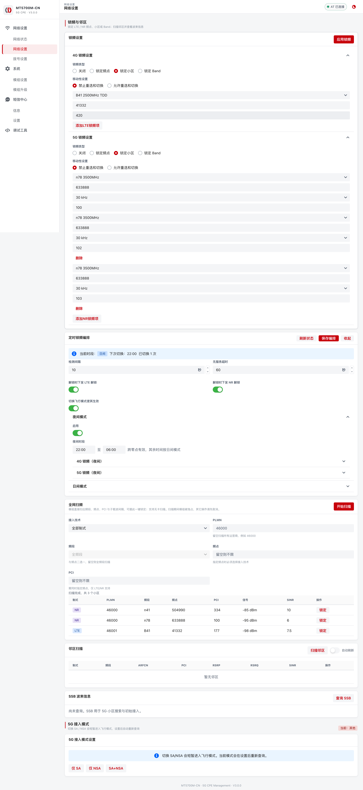
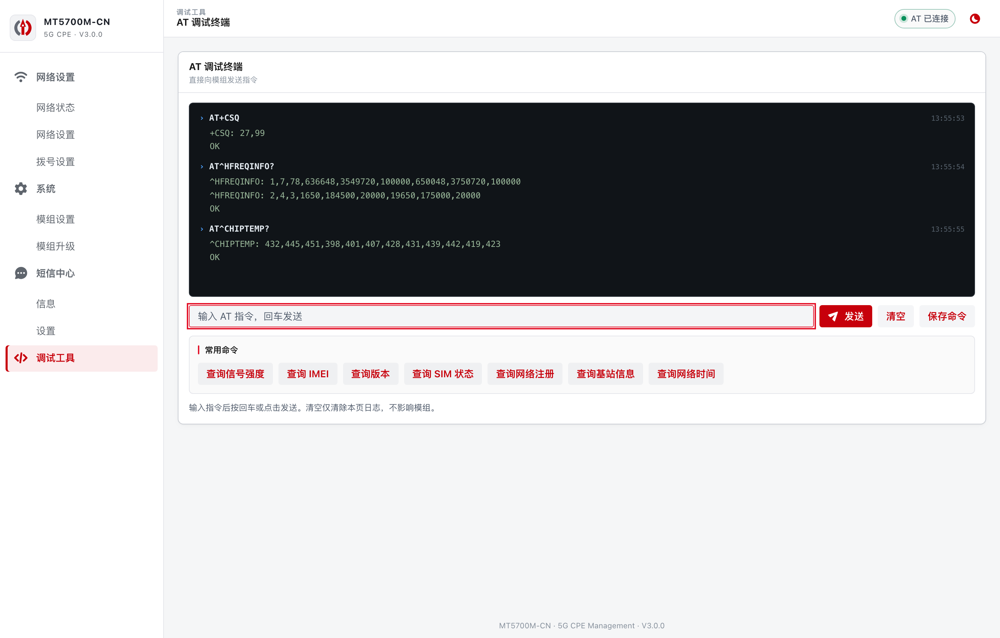

# MT5700M WebUI for OpenWrt

[](https://github.com/inotdream/mt5700webui-openwrt-server/actions/workflows/build.yml)

MT5700M-CN 5G 模组的 OpenWrt Web 管理界面：Go 单二进制后端（`at-webserver`）通过 WebSocket 直连模组 AT 口，前端为 React + Semi Design（`semi-tcpweb`），无需 Python 运行时。


## 功能

- **信号仪表盘**：RSRP/SINR 质量条与环形信号评分、信号趋势曲线、实时网速波形与流量统计
- **载波聚合**：主/辅载波频点、带宽、每载波信号质量与 MCS，EN-DC 与 5G 注册状态诊断
- **锁频锁小区（4G/5G）**：锁频点 / 锁小区 / 锁 Band，多条锁定项，ARFCN/PCI 输入校验
- **全网扫频**：`AT^CELLSCAN` 异步流式出结果、可随时打断、扫描结果一键锁定
- **定时锁频编排**：日间/夜间两套锁频方案定时切换，可选飞行模式过渡、失服自动解锁
- **短信**：会话视图、长短信自动分片（GSM-7/UCS2 自动选择编码）、USSD 查询
- **SIM 管理**：PIN/PUK 状态全局弹窗解锁、PIN 码启停与修改
- **AT 调试终端**：结构化收发日志、常用命令快捷键、自定义命令收藏
- **拨号管理**：APN/认证方式、拨号模式、PDP 上下文增删与激活、DMZ、网口模式
- **模组管理**：5G 接入模式（SA/NSA/DSS）、发射功率、芯片温度监控、模组升级
- 暗色模式、移动端自适应布局、WebSocket 密钥鉴权

| 暗色模式 | 移动端 |
| :---: | :---: |
|  |  |

<details>
<summary><b>更多截图（锁频/扫频、拨号、短信、AT 终端、系统信息）</b></summary>







</details>

## 安装

从 [Releases](https://github.com/inotdream/mt5700webui-openwrt-server/releases) 下载对应架构的包。两个都要装：`at-webserver`（后端 + WebUI）与 `luci-app-at-webserver`（LuCI 集成，架构无关）。

**OpenWrt 24.10 及更早版本（opkg，`.ipk`）：**

```sh
opkg install ./at-webserver_*_<架构>.ipk ./luci-app-at-webserver_*_all.ipk
```

**OpenWrt 主干 SNAPSHOT（apk，`.apk`）：**

```sh
apk add --allow-untrusted ./at-webserver-*_<架构>.apk ./luci-app-at-webserver-*.apk
```

常见设备架构对照：

| SoC / 平台 | 架构 |
| --- | --- |
| MT7981 / MT7986 / IPQ807x | `aarch64_cortex-a53` |
| 其他 ARM64（RK33xx 等） | `aarch64_generic` |
| IPQ40xx | `arm_cortex-a7_neon-vfpv4` |
| MT7621 | `mipsel_24kc` |
| QCA95xx / ath79 | `mips_24kc` |
| x86 软路由 | `x86_64` |

安装后访问 `http://路由器IP/5700/`，模组连接方式（串口 / tcp）与 WebSocket 密钥可在 LuCI「服务 → AT WebServer」中配置。

> 旧版（1.x，Python 版）网盘存档：https://www.123865.com/s/BwcjVv-PexFd?pwd=GweY 提取码 `GweY`

## 源码构建

**前端**（产物会同步到 `at-webserver/files/www/5700`，随包发布）：

```sh
cd semi-tcpweb
npm ci
npm run build && ./scripts/sync-www.sh
```

**OpenWrt 包**（把仓库当 feed 或复制包目录进 SDK）：

```sh
echo "src-git mt5700 https://github.com/inotdream/mt5700webui-openwrt-server.git" >> feeds.conf
./scripts/feeds update mt5700 && ./scripts/feeds install -a -p mt5700
make package/at-webserver/compile package/luci-app-at-webserver/compile V=s
```

Go 依赖已 vendor 进 `at-webserver/src/vendor`，编译过程无需联网。CI 会对每次推送做前端类型检查、Go 单测，并用官方 SDK 构建 6 种架构 × ipk/apk 两种格式；打 `v*` tag 自动发布 Release。

## 目录结构

| 目录 | 说明 |
| --- | --- |
| `at-webserver/` | Go 后端源码与 OpenWrt 打包（含 WebUI 构建产物） |
| `luci-app-at-webserver/` | LuCI 集成（服务开关、连接配置、定时锁频开关） |
| `semi-tcpweb/` | WebUI 前端源码（Vite + React + Semi Design） |
| `docs/` | 文档与截图 |

WebSocket 协议与伪命令（`AT+SCHED`、`AT^CELLSCAN` 等）见 [`at-webserver/API.md`](at-webserver/API.md)。
